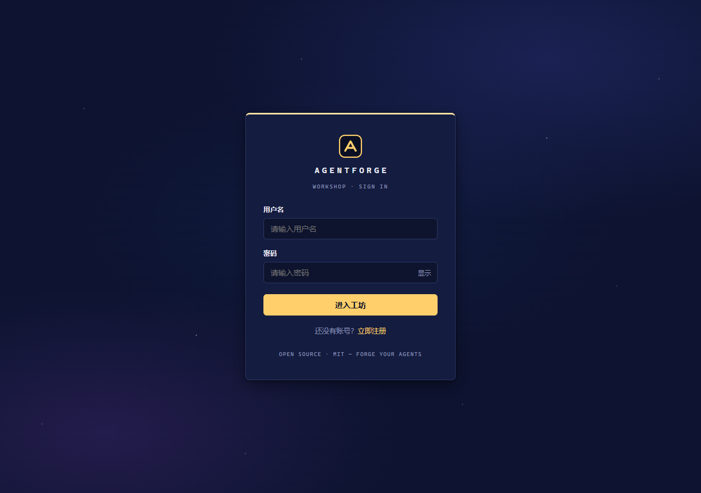
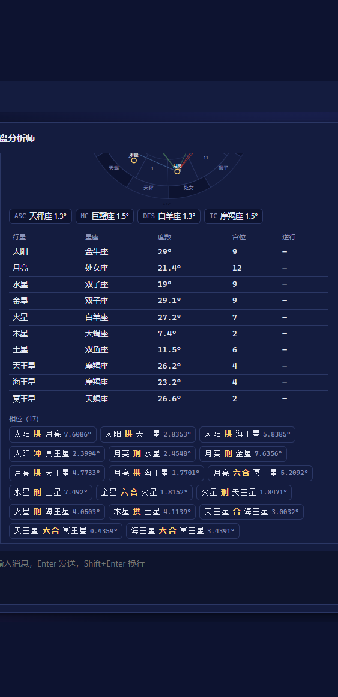

# AgentForge

<p align="center"><b>智能体（Agent）快速搭建与对话平台</b></p>

<p align="center">
  <a href="LICENSE"></a>
  <a href="https://github.com/2004TZK/AgentForge/actions"></a>
  
  
  
</p>

AgentForge 是一个开源的 LLM Agent 构建平台：创建智能体（系统提示词 / 模型 / 工具 / 运行模式）、与支持 **LLM 自主工具调用（ReAct 循环）** 和 **RAG 知识库** 的 Agent 对话，或把 Agent 切换为 **工作流模式** 执行自定义流程（查仓库 → 算指标 → 生成报告）。

项目内置一套开箱即用的 **星盘分析** 能力：瑞士星历排盘计算（pyswisseph，1800-2399 年、223 城市库）、星盘分析师智能体（逐星体详细解读，3000 字硬上限）、占星知识库 RAG（宫位 / 相位 / 格局 / 落座五件套）、一键深度分析工作流（排盘 → 分维度解读 → 汇总报告），前端配含黄道圈示意图的排盘卡片与**星空主题**界面。模型层通过 OpenAI 兼容接口接入**千问云端 API**（对话 qwen3.7-plus + 向量 text-embedding-v3），无需本地 GPU/大内存，响应快、部署轻。

## 功能特性

| 模块 | 能力 |
|---|---|
| 🤖 智能体 | 系统提示词 / 模型 / 温度 / **公开-私有可见性** / 工具按 Schema 配置（API Key 密码框） |
| 🔧 工具调用 | LLM 依据 JSON Schema **自主决策**（OpenAI 兼容 tools 参数），LangGraph **ReAct 多轮循环**（上限 3 轮），SSE 实时展示工具活动；规则触发保留兜底 |
| 📚 RAG 知识库 | 上传（pdf/docx/txt/md/**db/sqlite/sqlite3/csv**）→ 解析 → text-embedding-v3 Embedding → Qdrant 检索 → **来源引用**（数据库文件展示「文件 + 表名 + 行号」）；自动/手动切片（结构化按表/行分块）、异步入库进度、文件管理（重试/删除/同名覆盖） |
| 📜 Workflow v1 | JSON 线性流程（tool/llm 节点 + `{var}` 模板）→ LangGraph 编译执行 → **节点级日志**；Agent 对话模式/工作流模式 |
| 💬 对话 | SSE 流式打字机（**断流自愈**）、多会话、Redis 短期记忆（**按用户隔离**，TTL 24h，自动降级）、历史分页 |
| 🔮 星盘分析 | 瑞士星历排盘（pyswisseph，1800-2399、223 城市库、Tropical/Placidus 口径、高纬降级）、星盘分析师解读（逐星体详细展开、**3000 字硬上限**）、占星知识库 RAG、深度分析工作流、排盘卡片 + 黄道圈示意图 |
| 🎨 界面 | **星空主题**深色 UI（深空蓝 + 星辉金）、Markdown 排版渲染（标题 / 列表 / 表格 / 引用 / 分隔线）、排盘卡片与交互 |
| 🔐 权限 | JWT 认证、Agent 创建者隔离（改/删）、私有资源不可见（10003） |
| 🚀 工程化 | Docker Compose 一键部署、**CI 三端自动验证**、**数据库迁移自动化**（幂等）、AI 服务 **242 项测试**全绿 |

## 界面预览

| 登录页 | 智能体列表 |
|---|---|
|  |  |

| 星盘解读（排盘卡片 + 详细解读） | 排盘卡片特写（黄道圈） |
|---|---|
|  |  |

| 工作流列表 | 工作流编辑（只读图谱 + 节点日志） |
|---|---|
|  |  |

## 星盘分析

从排盘计算到解读、知识库与工作流，全链路已打通并通过端到端验证：

| 能力 | 说明 |
|---|---|
| 排盘计算工具 `star_chart` | pyswisseph 瑞士星历（1800-2399），223 条中国城市库（含历史夏令时），Tropical + Geocentric + Placidus 口径，高纬度自动降级整宫制，可切整宫制 / 恒星黄道；输出十星体、四轴、十二宫、相位、格局结构化 JSON |
| 星盘分析师智能体 | 绑定 `star_chart` 工具：输入出生日期 / 时间 / 地点自动排盘 → 按固定阅读逻辑逐星体详细解读（十星体 + 宫位 / 相位 / 格局 / 小结建议，**3000 字硬上限**，结尾免责声明），支持基于记忆的多轮追问 |
| 占星知识库 | 五件套文档（阅读逻辑手册 / 宫位解析 / 落座速查 / 守护星座表 / 格局速查表）切块入库 Qdrant，解读与知识问答带**来源引用**，命中对应宫位 / 相位 / 格局释义 |
| 深度分析工作流 | 预置「星盘深度分析」：`chart(tool 排盘) → dimension(llm 分维度解读) → summary(llm 汇总报告)` 线性链，运行记录含**节点级日志**（排盘 → 解读 → 汇总，含耗时） |
| 排盘卡片 | 聊天中实时渲染：四轴 / 行星落座落宫 / 相位 / 格局 / 宫位表格 + **黄道圈示意图**（相位配色：合=黄、拱=绿、六合=蓝、刑=红、冲=紫红），支持**导出 Markdown / 打印 PDF** 报告 |
| V2 扩展工具 | 行运 `transit_chart`（近期运势）、推运 `progression_chart`（次限推运，一天=一年）、合盘 `synastry_chart`（两人关系）、择时 `electional_chart`（启发式评分选日子），均复用 V1 口径并绑定「星盘分析师」智能体；报告导出支持 Markdown / PDF（`POST /star-chart/report`） |

体验示例：登录后在聊天页选择「星盘分析师」，发送 `1994-05-20 14:30 北京` 即可一键获得完整排盘与解读。

## 架构

```text
┌─────────────┐   ┌─────────────────────────────────────────────┐
│  浏览器 SPA  │   │                  Nginx 网关                  │
│  Vue3+Vite  │──▶│  /        → web (静态资源)                    │
│             │   │  /api/*   → backend (JWT 鉴权)                │
└─────────────┘   │  /ai/*    → ai (内网 X-Internal-Token)        │
                  └───────┬────────────────────┬─────────────────┘
                          │                    │
               ┌──────────▼──────────┐  ┌──────▼──────────────────┐
               │   backend (Java21)  │  │   ai (Python/FastAPI)   │
               │   Spring Boot 多模块 │  │  ├─ LangGraph ReAct     │
               │   JWT/MyBatis/Redis │  │  ├─ RAG (Qdrant 检索)   │
               │   SSE 透传/工作流触发│  │  ├─ Workflow 引擎       │
               │                      │  │  └─ star_chart 排盘     │
               └──┬───────┬──────┬───┘  └──┬───────┬──────┬───────┘
                  │       │      │         │       │      │
             ┌────▼──┐ ┌──▼───┐ ┌▼────┐  ┌─▼────┐ ┌─▼────┐ ┌▼──────┐
             │ MySQL │ │Redis │ │Qdrant│  │千问云端│ │Redis │ │Qdrant │
             │ 8     │ │ 7    │ │     │  │API    │ │      │ │       │
             └───────┘ └──────┘ └─────┘  └───────┘ └──────┘ └───────┘
```
> AI 服务与后端不暴露宿主机端口，全部经 Nginx 内网代理；LLM 与 Embedding 调用千问云端 API（OpenAI 兼容）；`migrate` 容器在启动时自动应用数据库迁移（幂等）。

## 快速开始

> 前置：Docker + Docker Compose + 千问云端 API Key（platform.qianwenai.com 申请）。30 分钟内即可从零复现一键部署。

```bash
# 1. 准备环境变量（修改默认密码与密钥）
cp .env.example .env
#    编辑 .env，填入 LLM_API_KEY=sk-xxxx（千问/DashScope 兼容模式 Key）

# 2. 一键启动
docker compose up -d --build

# 3. 访问
#   Web 入口       http://localhost
#   后端 API 文档  http://localhost/api/swagger-ui
#   健康检查       http://localhost/api/actuator/health
```

默认演示账号：`admin` / `admin123`（生产部署后请立即修改）。

内置演示智能体：**Java 专家**、**知识库助手**（Spring 知识库问答）、**GitHub 分析官**（工作流模式）、**星盘分析师**（排盘解读 + 占星知识库，已预置「星盘深度分析」工作流）。

> **HTTPS**：启动时 `ssl-init` 容器自动生成自签证书（幂等，已存在则复用），
> `https://localhost` 即可访问；生产环境请用正规 CA 证书替换
> `docker/nginx/certs/` 下同名文件后重启 nginx。
> **备份**：`./scripts/backup.sh` 一键导出 MySQL 全量 + Qdrant 快照（保留 7 天），
> 恢复步骤见 `scripts/restore.md`。

### 升级已有部署

```bash
git pull && docker compose up -d --build
# 数据库迁移由 migrate 容器自动执行（新增 upgrade/*.sql 幂等应用，无需手工操作）
```

## 本地开发

```bash
# 1. 仅启动中间件
docker compose -f docker-compose.dev.yml up -d

# 2. 后端（端口 8080）
cd agentforge-backend && mvn -pl agentforge-start -am spring-boot:run

# 3. AI 服务（端口 8000；Windows 需设置 UPLOAD_DIR 指向后端上传目录，见注释）
cd agentforge-ai && pip install -r requirements.txt
#   ⚠ Windows 本地请用 Python 3.11（pyswisseph 无 cp312 wheel，见 docs/星盘分析开发任务拆分.md）
export UPLOAD_DIR=../agentforge-backend/data/uploads
uvicorn app.main:app --port 8000 --reload

# 4. 前端（端口 5173，/api 由 Vite proxy 转发到 8080）
cd agentforge-web && npm install && npm run dev
```

### 运行测试（CI 等价命令）

```bash
cd agentforge-backend && mvn test -pl agentforge-start -am   # Java 集成测试
cd agentforge-ai && pytest -q                                 # Python 单元测试
cd agentforge-web && npm run build                            # 前端生产构建
```

## 技术栈

| 端 | 技术 | 说明 |
|---|---|---|
| agentforge-web | Vue 3 + TypeScript + Vite + Pinia | 星空主题 SPA（Element Plus 按需引入，主包 <10KB） |
| agentforge-backend | Spring Boot 3.3（Java 21）+ MyBatis Plus + Spring Security/JWT + Redis | 8 模块 Maven 架构 |
| agentforge-ai | Python 3.12 + FastAPI + LangGraph + Qdrant + Redis + **pyswisseph** | 对话 / RAG / 工具循环 / 工作流引擎 / 星盘排盘 |
| 中间件 | MySQL 8 / Redis 7 / Qdrant | Docker Compose 一键启动 |
| 模型 | 千问云端（对话 qwen3.7-plus + 向量 text-embedding-v3，OpenAI 兼容） | DashScope 兼容模式 API |

## 目录结构

```text
AgentForge/
├── agentforge-web/       # 前端 SPA
├── agentforge-backend/   # 后端（8 个 Maven 模块）
├── agentforge-ai/        # Python AI 服务
├── docker/
│   ├── mysql/init/       # 首次建库（6 张基础表）
│   ├── mysql/upgrade/    # 增量迁移（migrate 容器自动执行，幂等）
│   └── nginx/            # 边缘网关
├── docs/                 # 架构 / 数据库 / API / 开发规划
└── docker-compose.yml    # 一键启动（生产/演示形态）
```

## 文档

- [总体架构](docs/architecture.md)
- [数据库设计](docs/database.md)
- [API 文档](docs/api.md)
- [项目开发规划](docs/项目开发规划.md)
- [用户使用指南](docs/user-guide.md)
- [演示数据与操作指南](docs/demo-data.md)
- [星盘分析功能设计](docs/星盘分析功能设计.md)
- [星盘分析开发任务拆分](docs/星盘分析开发任务拆分.md)
- [星盘分析师系统提示词](docs/星盘分析师系统提示词.md)
- [贡献指南](CONTRIBUTING.md) · [行为准则](CODE_OF_CONDUCT.md)

## 路线图

| 里程碑 | 状态 |
|---|---|
| M1 Phase 2 收尾：SSE 流式、错误规范化、Java 测试基础 | ✅ |
| M2 Phase 3：RAG 知识库（text-embedding-v3 + Qdrant）、多会话、文件管理 | ✅ |
| M3 Phase 4：LLM 工具循环（ReAct）、Memory 按用户隔离、Workflow v1 | ✅ |
| 星盘分析 M1：排盘计算工具（pyswisseph、城市库、基准测试） | ✅ |
| 星盘分析 M2：星盘分析师智能体（排盘 → 解读，端到端实测） | ✅ |
| 星盘分析 M3：深度分析工作流 + 知识库入库 + 排盘卡片/黄道圈 | ✅ |
| M4 Phase 5：工程化与开源发布（CI/CD、加固、公开/私有、MIT） | 🚧 进行中 |

## License

[MIT](LICENSE) © 2026 [2004TZK](https://github.com/2004TZK)
