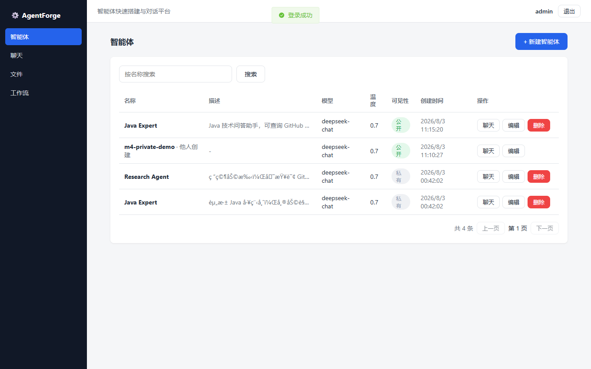
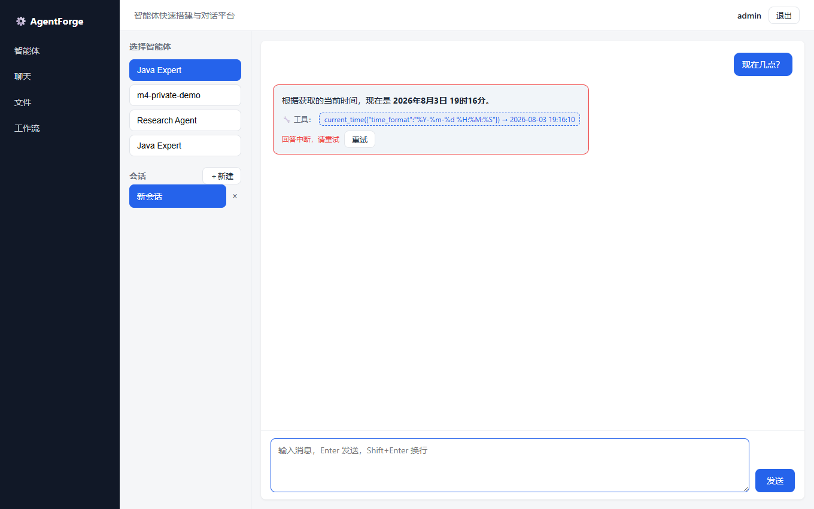
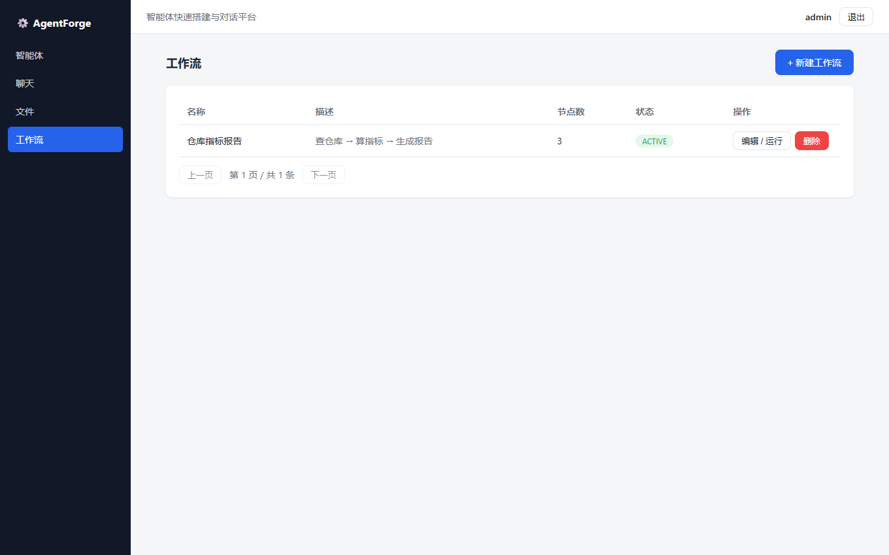
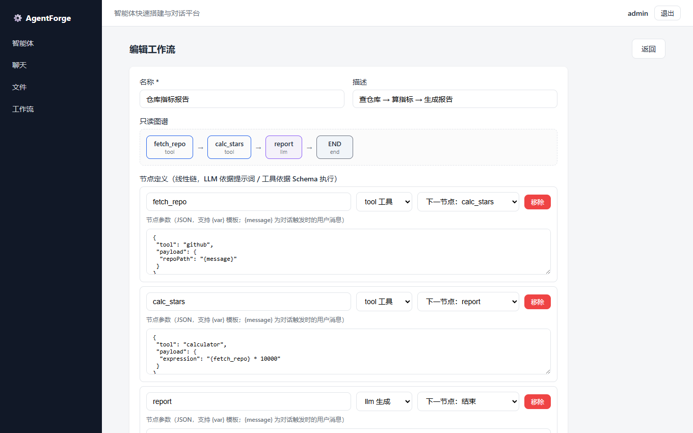

# AgentForge

<p align="center"><b>智能体（Agent）快速搭建与对话平台</b></p>

<p align="center">
  <a href="LICENSE"></a>
  <a href="https://github.com/2004TZK/AgentForge/actions"></a>
  
  
  
</p>

AgentForge 是一个全本地、可离线演示的 LLM Agent 平台：创建智能体（系统提示词 / 模型 / 工具 / 运行模式）、与支持 **LLM 自主工具调用（ReAct 循环）** 和 **RAG 知识库** 的 Agent 对话，或把 Agent 切换为 **工作流模式** 执行自定义流程（查仓库 → 算指标 → 生成报告）。模型完全跑在本地 Ollama（对话 qwen3.5:0.8b + 向量 bge-m3），零 API 费用、可离线演示。

## 功能特性

| 模块 | 能力 |
|---|---|
| 🤖 智能体 | 系统提示词 / 模型 / 温度 / **公开-私有可见性** / 工具按 Schema 配置（API Key 密码框） |
| 🔧 工具调用 | LLM 依据 JSON Schema **自主决策**（OpenAI 兼容 tools 参数），LangGraph **ReAct 多轮循环**（上限 3 轮），SSE 实时展示工具活动；规则触发保留兜底 |
| 📚 RAG 知识库 | 上传（pdf/docx/txt/md）→ 解析 → bge-m3 Embedding → Qdrant 检索 → **来源引用**；文件管理（重试/删除/同名覆盖） |
| 📜 Workflow v1 | YAML/JSON 线性流程（tool/llm 节点 + `{var}` 模板）→ LangGraph 编译执行 → **节点级日志**；Agent 对话模式/工作流模式 |
| 💬 对话 | SSE 流式打字机、多会话、Redis 短期记忆（**按用户隔离**，TTL 24h，自动降级）、历史分页 |
| 🔐 权限 | JWT 认证、Agent 创建者隔离（改/删）、私有资源不可见（10003） |
| 🚀 工程化 | Docker Compose 一键部署、**CI 三端自动验证**、**数据库迁移自动化**（幂等）、集成测试（Java 30 / Python 61） |

## 界面预览

| 智能体列表 | 对话（工具调用实时展示） |
|---|---|
|  |  |

| 工作流列表 | 工作流编辑（只读图谱 + 节点日志） |
|---|---|
|  |  |

## 架构

```text
┌─────────────┐   ┌─────────────────────────────────────────────┐
│  浏览器 SPA  │   │                  Nginx 网关                  │
│  Vue3+Vite  │──▶│  /        → web (静态资源)                    │
│             │   │  /api/*   → backend (JWT 鉴权)                │
└─────────────┘   │  /ai/*    → ai (内网 X-Internal-Token)        │
                  └───────┬────────────────────┬─────────────────┘
                          │                    │
               ┌──────────▼──────────┐  ┌──────▼──────────────────┐
               │   backend (Java21)  │  │   ai (Python/FastAPI)   │
               │   Spring Boot 多模块 │  │  ├─ LangGraph ReAct     │
               │   JWT/MyBatis/Redis │  │  ├─ RAG (Qdrant 检索)   │
               │   SSE 透传/工作流触发│  │  ├─ Workflow 引擎       │
               └──┬───────┬──────┬───┘  └──┬───────┬──────┬───────┘
                  │       │      │         │       │      │
             ┌────▼──┐ ┌──▼───┐ ┌▼────┐  ┌─▼────┐ ┌─▼────┐ ┌▼──────┐
             │ MySQL │ │Redis │ │Qdrant│  │Ollama │ │Redis │ │Qdrant │
             │ 8     │ │ 7    │ │     │  │qwen3.5│ │      │ │ bge-m3│
             └───────┘ └──────┘ └─────┘  └──────┘ └──────┘ └───────┘
```
> AI 服务与后端不暴露宿主机端口，全部经 Nginx 内网代理；`migrate` 容器在启动时自动应用数据库迁移（幂等）。

## 快速开始

> 前置：Docker + Docker Compose。30 分钟内即可从零复现一键部署。

```bash
# 1. 准备环境变量（修改默认密码与密钥）
cp .env.example .env

# 2. 一键启动（首次自动拉取模型 bge-m3 + qwen3.5:0.8b，约需数分钟）
docker compose up -d --build

# 3. 访问
#   Web 入口       http://localhost
#   后端 API 文档  http://localhost/api/swagger-ui
#   健康检查       http://localhost/api/actuator/health
```

默认演示账号：`admin` / `admin123`（生产部署后请立即修改）。

### 升级已有部署

```bash
git pull && docker compose up -d --build
# 数据库迁移由 migrate 容器自动执行（新增 upgrade/*.sql 幂等应用，无需手工操作）
```

## 本地开发

```bash
# 1. 仅启动中间件
docker compose -f docker-compose.dev.yml up -d

# 2. 后端（端口 8080）
cd agentforge-backend && mvn -pl agentforge-start -am spring-boot:run

# 3. AI 服务（端口 8000；Windows 需设置 UPLOAD_DIR 指向后端上传目录，见注释）
cd agentforge-ai && pip install -r requirements.txt
export UPLOAD_DIR=../agentforge-backend/data/uploads
uvicorn app.main:app --port 8000 --reload

# 4. 前端（端口 5173，/api 由 Vite proxy 转发到 8080）
cd agentforge-web && npm install && npm run dev
```

### 运行测试（CI 等价命令）

```bash
cd agentforge-backend && mvn test -pl agentforge-start -am   # Java 集成测试
cd agentforge-ai && pytest -q                                 # Python 单元测试
cd agentforge-web && npm run build                            # 前端生产构建
```

## 技术栈

| 端 | 技术 | 说明 |
|---|---|---|
| agentforge-web | Vue 3 + TypeScript + Vite + Pinia | SPA（Element Plus 按需引入，主包 <10KB） |
| agentforge-backend | Spring Boot 3.3（Java 21）+ MyBatis Plus + Spring Security/JWT + Redis | 8 模块 Maven 架构 |
| agentforge-ai | Python 3.12 + FastAPI + LangGraph + Qdrant + Redis | 对话 / RAG / 工具循环 / 工作流引擎 |
| 中间件 | MySQL 8 / Redis 7 / Qdrant / Ollama（qwen3.5:0.8b + bge-m3） | Docker Compose 一键启动 |

## 目录结构

```text
AgentForge/
├── agentforge-web/       # 前端 SPA
├── agentforge-backend/   # 后端（8 个 Maven 模块）
├── agentforge-ai/        # Python AI 服务
├── docker/
│   ├── mysql/init/       # 首次建库（6 张基础表）
│   ├── mysql/upgrade/    # 增量迁移（migrate 容器自动执行，幂等）
│   └── nginx/            # 边缘网关
├── docs/                 # 架构 / 数据库 / API / 开发规划
└── docker-compose.yml    # 一键启动（生产/演示形态）
```

## 文档

- [总体架构](docs/architecture.md)
- [数据库设计](docs/database.md)
- [API 文档](docs/api.md)
- [项目开发规划](docs/项目开发规划.md)
- [用户使用指南](docs/user-guide.md)
- [贡献指南](CONTRIBUTING.md) · [行为准则](CODE_OF_CONDUCT.md)

## 路线图

| 里程碑 | 状态 |
|---|---|
| M1 Phase 2 收尾：SSE 流式、错误规范化、Java 测试基础 | ✅ |
| M2 Phase 3：RAG 知识库（bge-m3 + Qdrant）、多会话、文件管理 | ✅ |
| M3 Phase 4：LLM 工具循环（ReAct）、Memory 按用户隔离、Workflow v1 | ✅ |
| M4 Phase 5：工程化与开源发布（CI/CD、加固、公开/私有、MIT） | 🚧 进行中 |

## License

[MIT](LICENSE) © 2026 [2004TZK](https://github.com/2004TZK)
